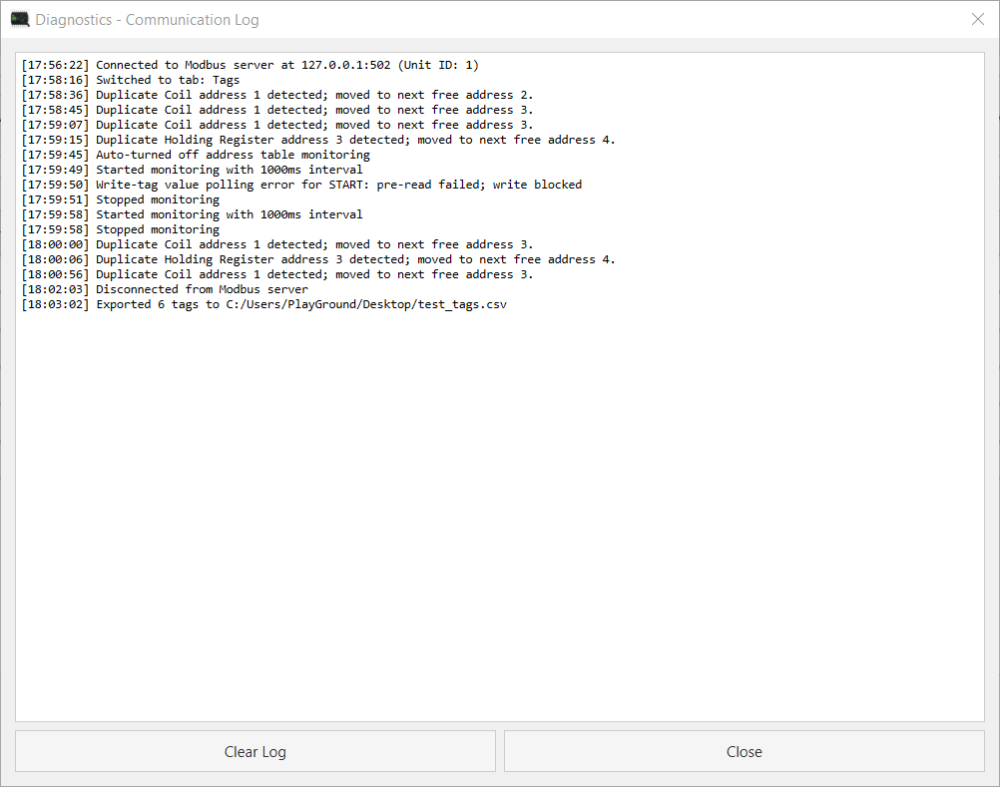
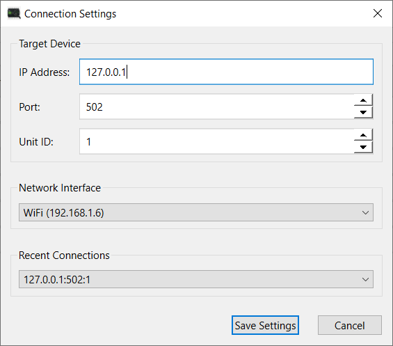
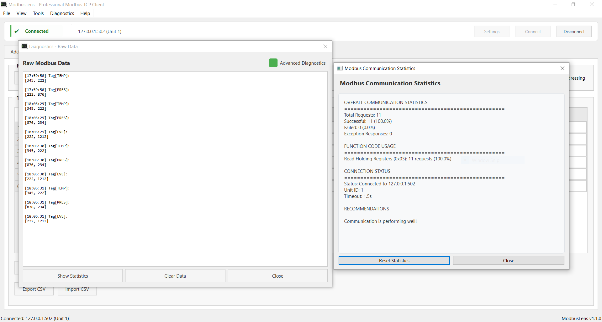

  

<h1 align="center">ModbusLens</h1>

Free Modbus TCP Client with Advanced Network Discovery & Diagnostics

  <a href="#overview">Overview</a> |
  <a href="#highlights">Highlights</a> |
  <a href="#screenshots">Screenshots</a> |
  <a href="#features">Features</a> |
  <a href="#installation">Installation</a> |
  <a href="#notes">Notes</a> |
  <a href="#upcoming-features">Upcoming Features</a>

---

## Overview

**ModbusLens** is a **free desktop tool** built for engineers working with **Modbus TCP devices**, combining communication, monitoring, and network diagnostics in one place.

> Currently supports **Modbus TCP/IP only**

---

## Highlights

- ARP-based device discovery (no IP needed)
- Automatic Modbus device detection
- Continuous live scanning (no repeated manual scans)
- Clean, non-spam device listing
- Integrated diagnostics + communication
- Live/historical trend graphing with up to 20 pens

---

## Screenshots

### Main Interface

  

### Address Table (Read / Write)

  

### Tag Monitoring

  

### Network Discovery & Diagnostics

  

### Communication Log

  

### Connection Parameters

  

### Status & Monitoring View

  

---

## Features

### Modbus TCP
- Read coils, inputs, holding & input registers  
- Write single/multiple coils & registers  
- Address table for quick testing  

### Data Handling
- BOOL, U16/S16, U32/S32, F32, HEX support  
- BOOL on a register shows the full 16-bit pattern, not just a single flag  
- Word order handling (*_SWAP)  
- 0-based / 1-based addressing, selectable per Address Table range and per Tag  

### Monitoring
- Real-time tag monitoring, with Read Value/Write Value/Timestamp built into the same Tags table  
- Insert new tags anywhere in the list, not just at the end  
- Write to a tag while monitoring stays active  
- CSV import/export  
- Improved stability  

### Trend
- Up to 20 pens, each bound to its own address/type/format  
- Live mode (follows the current time) or Historical mode (view stays put while data keeps recording)  
- Adjustable time window, zoom in/out  
- Graph Properties: axis titles, background/axis/grid colors, grid on/off, Y-axis auto or manual range  
- Print to PNG or PDF  

### Network Diagnostics
- ARP-based discovery  
- Modbus device detection  
- Packet capture (Npcap required)  
- Device filtering (Modbus only)  

### UI Improvements
- Cleaner layout with compact connection bar  
- Improved status indicators  
- Better spacing and readability  
- More focused workspace (Address/Tags/Trend priority)  
- Forces a light theme even when Windows is set to dark mode  

---

## Installation

Download latest release:  
https://github.com/CraftParking/ModbusLens/releases

Run:
ModbusLens.exe

---

## Notes

- Advanced diagnostics require **Npcap**  
  https://npcap.com/#download  

- Enable during install:
  - WinPcap compatible mode  
  - Raw 802.11 (optional)

- Restart app after install  

- If errors:
  No libpcap provider available  
  or  
  Scapy not available  

Install dependency:
pip install scapy

---

## Upcoming Features

- Modbus RTU support  
- Multi-device management  
- Modbus server/slave mode  
- Data logging  
- Scripting & automation  

---

## Support

ModbusLens is **free software**.

If it helps you, consider supporting development:

  

---

## Author

**Alvin (CraftParking)**