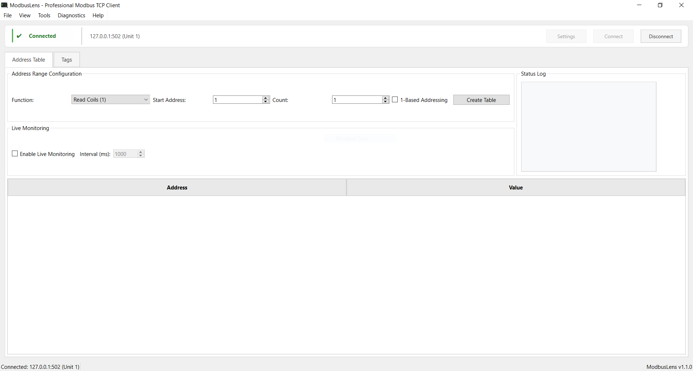
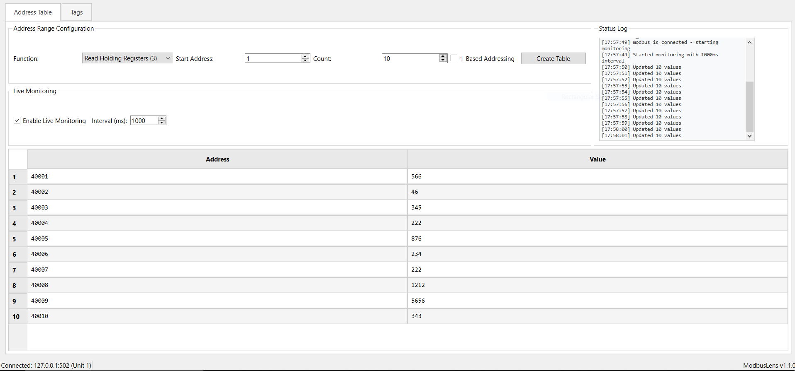
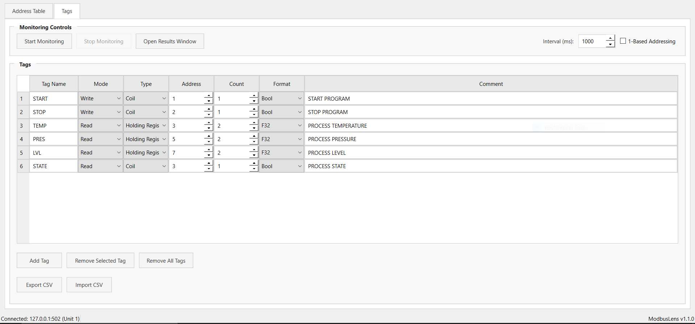
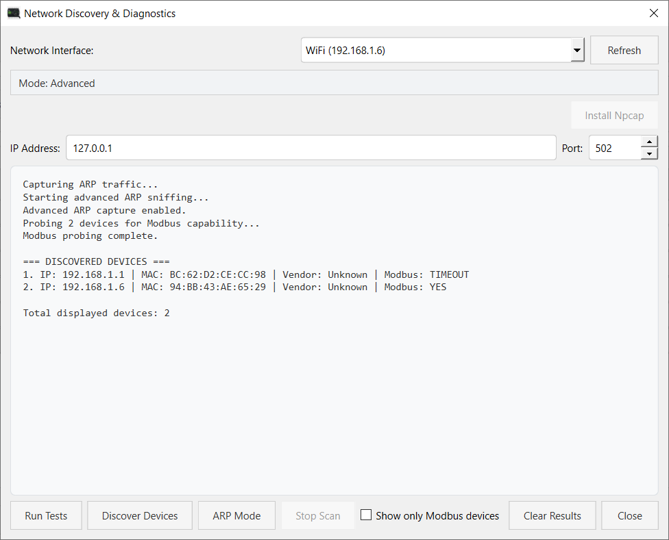

<p align="center">
  
</p>

<h1 align="center">ModbusLens</h1>
<p align="center">Modbus TCP Client with Advanced Network Discovery & Diagnostics</p>

<p align="center">
  <a href="#overview">Overview</a> |
  <a href="#highlights">Highlights</a> |
  <a href="#how-it-works">How It Works</a> |
  <a href="#screenshots">Screenshots</a> |
  <a href="#features">Features</a> |
  <a href="#installation">Installation</a> |
  <a href="#usage">Usage</a> |
  <a href="#notes">Notes</a> |
  <a href="#upcoming-features">Upcoming Features</a>
</p>

---

## Overview

**ModbusLens** is a desktop tool built for engineers working with **Modbus TCP devices**, combining communication, monitoring, and network diagnostics in a single interface.

It is designed not just to communicate with devices, but to **discover and troubleshoot them**, even when network details are unknown.

> **Note:** Currently supports **Modbus TCP/IP only**.

---

## Highlights

- **ARP-Based Device Discovery**  
  Discover devices without knowing their IP address — ideal for unknown or misconfigured PLCs.

- **Live Continuous Scanning**  
  Devices appear in real-time without requiring repeated manual scans.

- **Automatic Modbus Detection**  
  Identifies which discovered devices respond to Modbus TCP.

- **Clean, Non-Spam Output**  
  Uses a unique device registry to prevent duplicate entries during continuous scanning.

- **Subnet Awareness**  
  Detects subnet mismatches and helps diagnose connectivity issues.

---

## How It Works

### ARP-Based Discovery

ModbusLens uses **ARP (Address Resolution Protocol)** to identify devices on your local network.

- Each device has an **IP address** and a **MAC address**
- ARP maps IP addresses to MAC addresses
- The tool sends ARP requests across the subnet (e.g., 192.168.1.x)
- Active devices respond with their MAC address
- Devices are discovered **even if their IP is unknown beforehand**

After discovery:
- Each device is tested for **Modbus TCP communication**
- Results are shown in real-time

### Why this approach is useful

- No need to manually scan IP ranges  
- Helps locate unknown or misconfigured PLCs  
- Works reliably within local networks  
- Faster than traditional ping-only scanning  

---

## Screenshots

### Main Interface

<p align="center">
  
</p>

---

### Address Table (Modbus Read/Write)

<p align="center">
  
</p>

---

### Tag Monitoring

<p align="center">
  
</p>

---

### Network Discovery & Diagnostics (ARP-Based)

<p align="center">
  
</p>

---

## Features

### Modbus TCP
- Read coils, discrete inputs, holding registers, and input registers  
- Write single and multiple coils/registers  
- Configure IP, port, unit ID, and address ranges  
- Address table for quick testing  

### Monitoring
- Real-time tag monitoring with configurable polling  
- Structured tag configuration  
- CSV import/export support  
- Detached monitoring results window  

### Network Discovery & Diagnostics
- Continuous ARP-based device discovery  
- Automatic Modbus device detection  
- Filter to show only Modbus devices  
- Packet capture support (Npcap required)  
- Vendor identification (via MAC address where available)  
- Stop scan control with proper cleanup  

### User Interface
- PySide6-based desktop GUI  
- Connection status indicators  
- Dedicated diagnostics window  
- Responsive layout  

---

## Installation

### Windows

Download the latest release:  
https://github.com/professoroptimusprime/ModScope/releases

Run:
```
ModbusLens.exe
```

---

### From Source

```bash
git clone https://github.com/professoroptimusprime/ModScope.git
cd ModScope
pip install -r requirements.txt
python gui_main.py
```

---

## Usage

- Enter target IP, port, and unit ID to connect  
- Use Address Table for read/write operations  
- Configure tags and start monitoring  
- Open **Diagnostics → Network Discovery & Diagnostics**  
- Start discovery to identify devices on the network  

---

## Notes

- Advanced packet capture features require **Npcap (WinPcap-compatible driver)**  
  Download: https://npcap.com/#download  

- During installation, enable:  
  - WinPcap API-compatible mode  
  - Raw 802.11 support (optional but recommended)  

- Restart the application after installing Npcap  

- If you see errors like:
  ```
  No libpcap provider available
  ```
  or
  ```
  Scapy not available
  ```
  then:
  - Install Npcap  
  - Install Scapy using:
    ```
    pip install scapy
    ```

---

## Upcoming Features

- Modbus RTU support  
- Multi-device management  
- Data logging and export  
- Advanced scripting and automation  

---

## Author

**Alvin (CraftParking)**