

  

<h1 align="center">ModbusLens</h1>

Free Modbus TCP &amp; RTU Client with Advanced Network Discovery &amp; Diagnostics

  <a href="#overview">Overview</a> |
  <a href="#highlights">Highlights</a> |
  <a href="#screenshots">Screenshots</a> |
  <a href="#features">Features</a> |
  <a href="#installation">Installation</a> |
  <a href="#notes">Notes</a> |
  <a href="#upcoming-features">Upcoming Features</a>

---

## Overview

**ModbusLens** is a **free desktop tool** built for engineers working with **Modbus devices**, combining communication, monitoring, and network diagnostics in one place.

> Supports **Modbus TCP/IP** and **Modbus Serial**, both RTU and ASCII framing

---

## Highlights

- Modbus TCP and Modbus Serial (RTU or ASCII framing) client, switchable per connection
- Fast parallel network scan, sized to your actual subnet mask - a full /24 in about a second, each hit already Modbus-verified
- Fast LAN Mode - short timeout, no retries, and an instant reachability check instead of retrying every tag when a device drops off
- Optional interface binding - pick a specific NIC so a multi-homed machine (VPN + Ethernet + Wi-Fi) connects out the one you actually chose
- ARP-based device discovery (no IP needed)
- Automatic Modbus device detection
- Continuous live scanning (no repeated manual scans)
- Clean, non-spam device listing
- Integrated diagnostics + communication
- Trend graphing with up to 20 tag-based pens, detachable into its own resizable, always-on-top window
- Act as a Modbus TCP slave for testing your own SCADA/PLC programs
- Talk to multiple devices at once, each in its own window
- Simple scripting for repeatable write/wait/read test sequences, against either a live device or ModbusLens's own Server simulator
- Serial Discovery: sweep common baud rate/parity/stop-bit/Unit ID combinations to find the settings a serial device actually uses
- Scanner: auto-discover which addresses actually respond on a connected device (TCP or serial)
- Modbus Diagnostic Functions: FC07/08/11/12/17/20/21/22/24/43 - exception status, diagnostics, comm event counter/log, report server ID, file record read/write, mask write register, FIFO queue, and device identification
- Save/Load Session: connection settings, Tags, Address Table range, and write bounds together in one file

---

## Screenshots

### Main Interface

  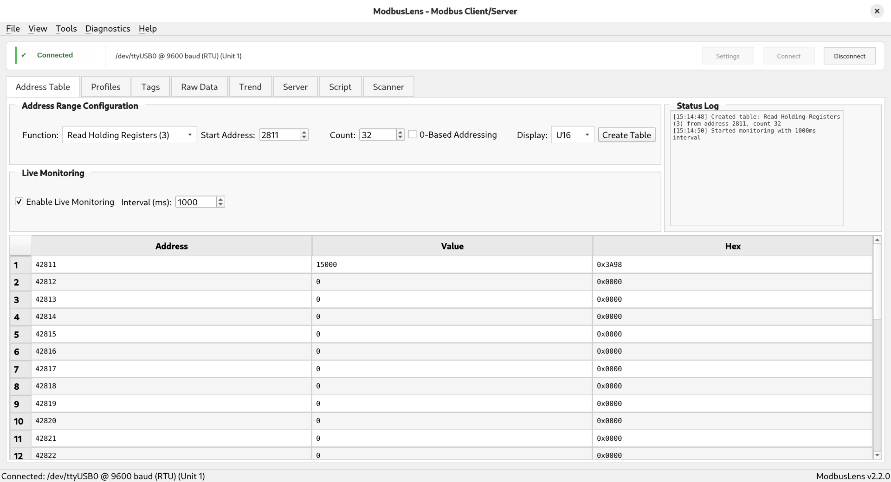

<em>Address Table - quick read/write grid for a contiguous register range, with live monitoring and a status log alongside it.</em>

### Tag Monitoring

  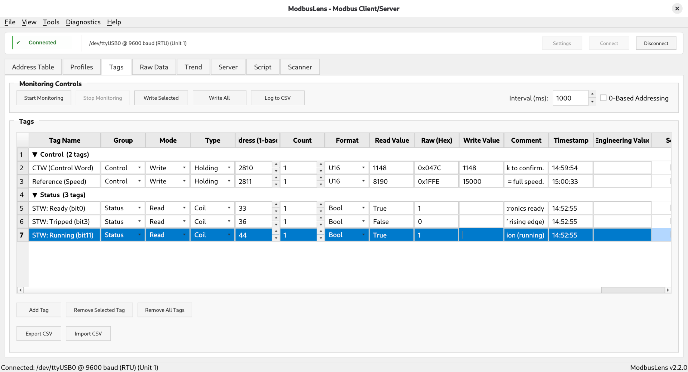

<em>Named tags across different addresses and types, monitored and written together in one list.</em>

### Raw Data

  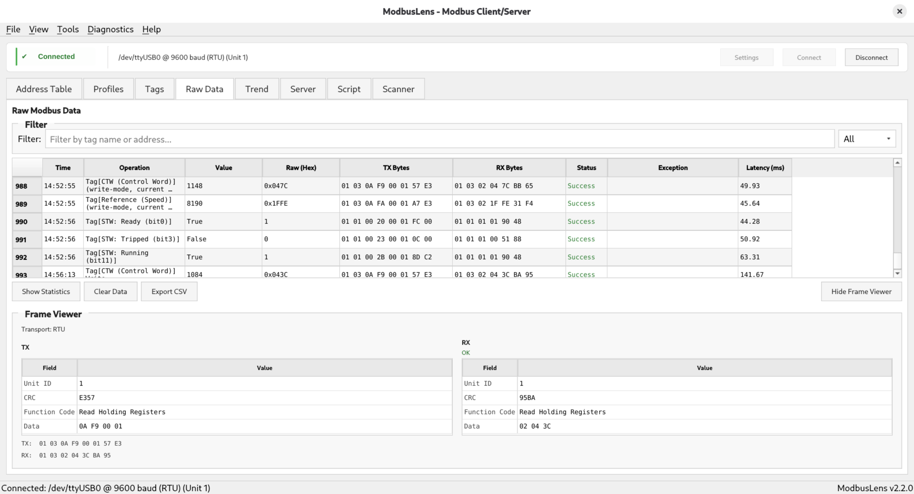

<em>Every transaction's actual wire bytes, decoded value, latency, and status - the ground truth behind whatever a Tag or Address Table row shows.</em>

### Trend

  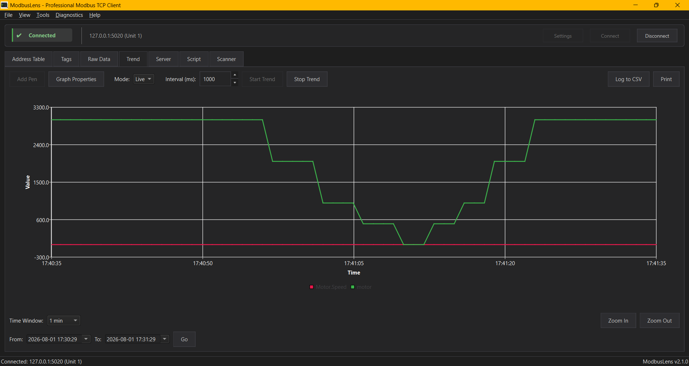

<em>Live graphing of monitored values over time, up to 20 pens per graph.</em>

### Server Mode

  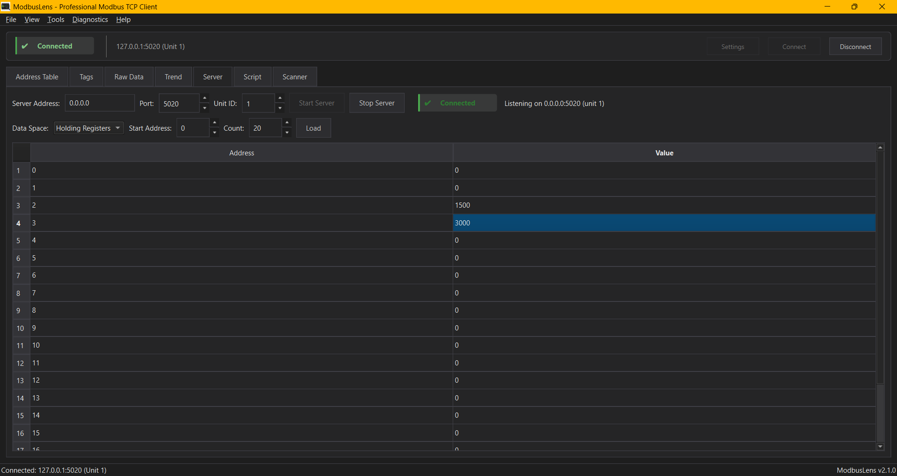

<em>ModbusLens acting as a Modbus TCP slave, so you can test a SCADA/PLC program - or another ModbusLens window - against it without real hardware.</em>

### Scripting

  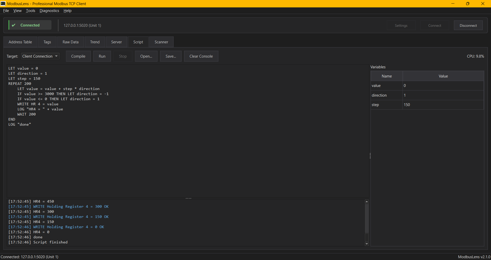

<em>A write/wait/read test sequence running against the Server simulator, with the live Variables panel tracking state on the right.</em>

### Scanner

  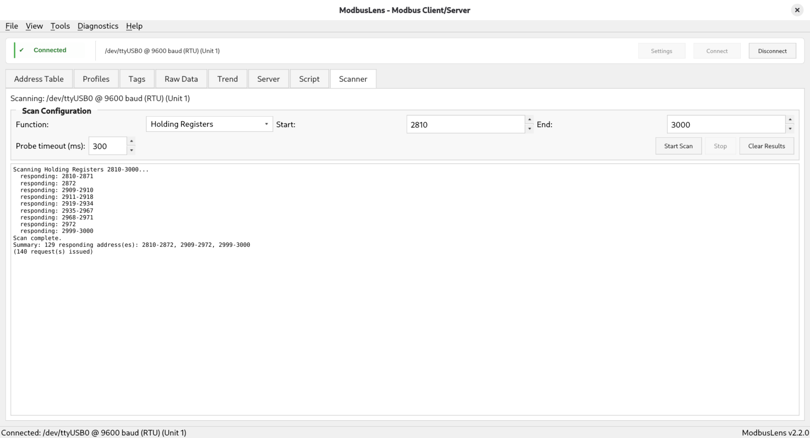

<em>Auto-discovering which Holding Register addresses respond on the connected device, in blocks rather than one address at a time.</em>

### Connection Settings

  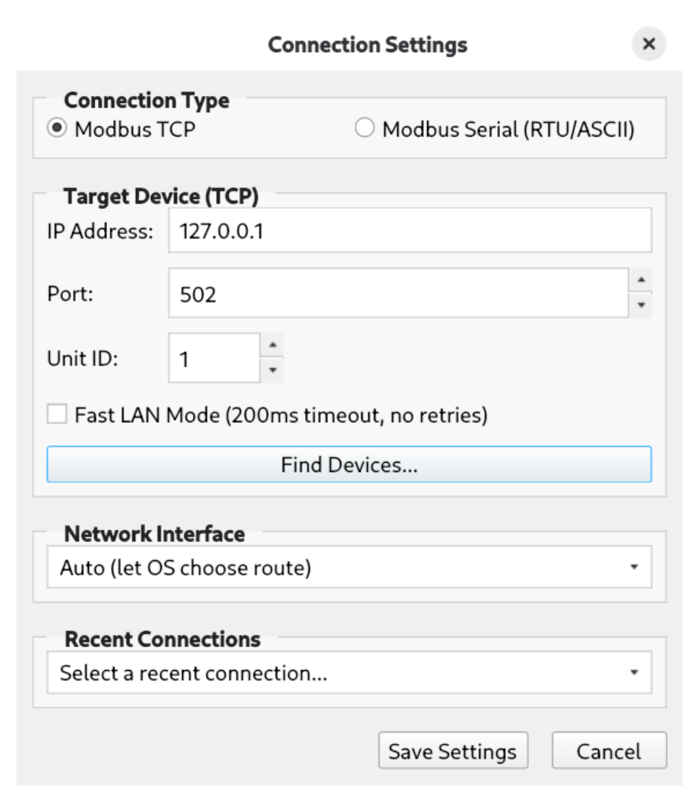
  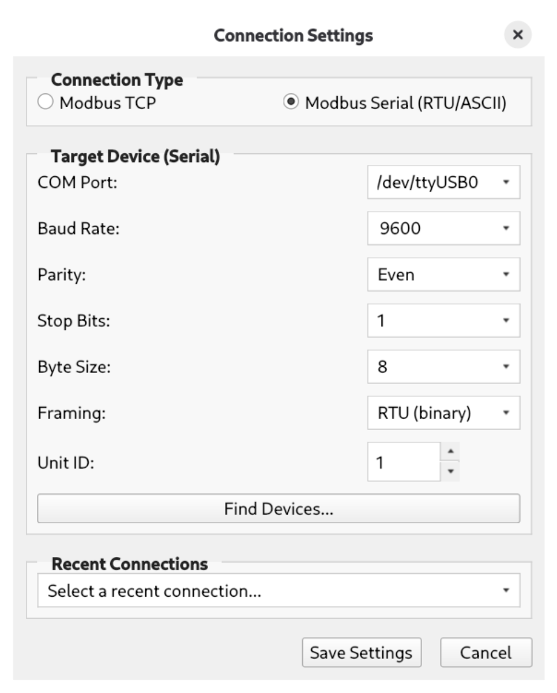

<em>Modbus TCP (left) and Modbus Serial RTU/ASCII (right) - one dialog, switchable per connection.</em>

### IP Configuration

  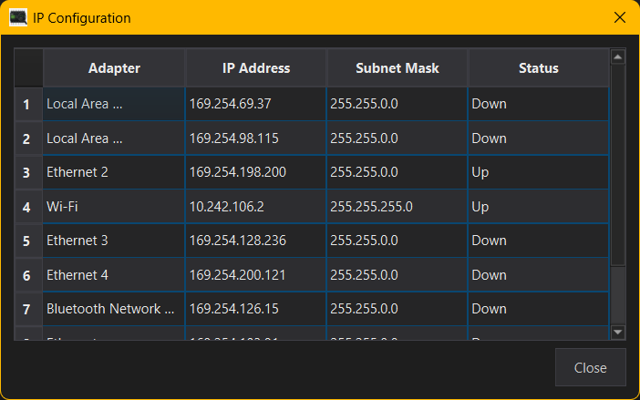

<em>Read-only view of this machine's own network adapters, for figuring out which one to connect from.</em>

### Theme

  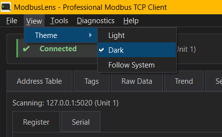

<em>Light, Dark, or Follow System, switchable from View > Theme (takes effect after restart).</em>

### Network Discovery & Diagnostics

  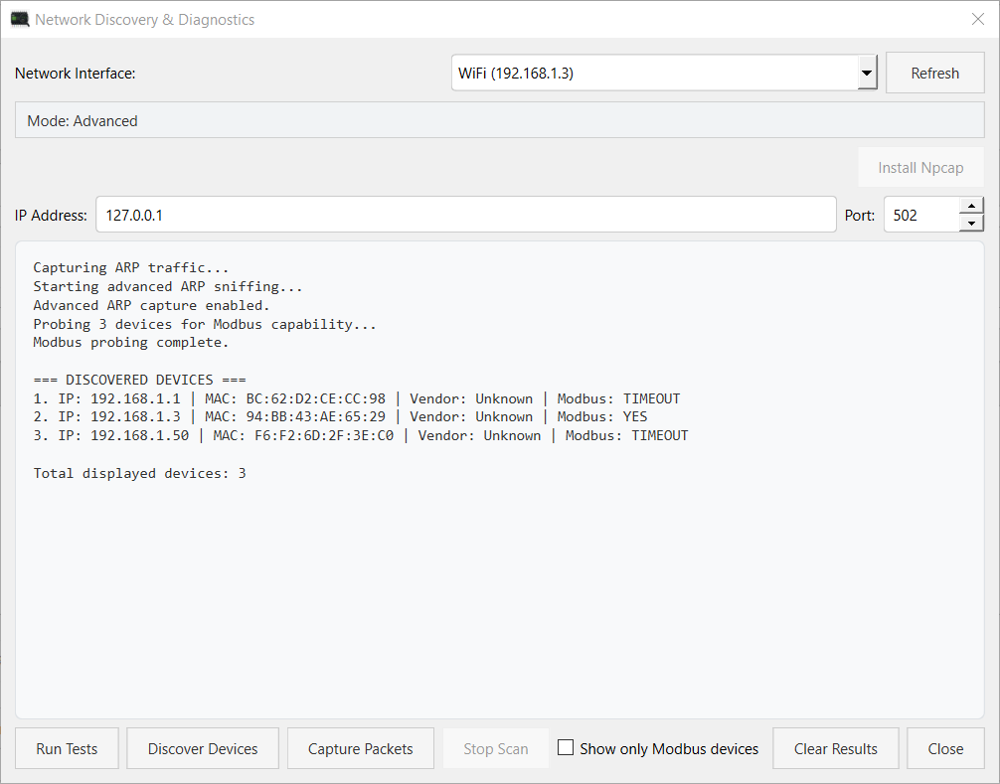

<em>ARP-based device discovery plus Modbus detection, for finding a device's IP when you don't already know it.</em>

---

## Features

### Modbus TCP & RTU
- Read coils, inputs, holding & input registers  
- Write single/multiple coils & registers  
- Modbus TCP (IP/Port/Unit ID) or Modbus Serial (COM port, baud, parity, stop bits, byte size, and RTU/ASCII framing) - pick per connection in Settings  
- Address table for quick testing  
- Optional Min/Max write bounds per register - a write outside the range is rejected before it reaches the device, no matter if it came from the Address Table, Tags, or a Script  
- Auto-reconnect with backoff after an unexpected drop, and automatic resume of Tags monitoring once the connection recovers  
- Multiple simultaneous connections via independent windows (File > New Connection Window)  
- Optional interface binding in Connection Settings - "Auto" leaves routing to the OS (default); picking a NIC binds the outgoing TCP socket to it  
- Fast LAN Mode (Connection Settings, TCP) - 200ms timeout, no retries; on a poll failure it probes reachability once instead of paying a timeout for every remaining tag  
- Save/Load Session (File menu) - connection settings, Tags (with scaling), Address Table range, and any live write bounds together in one `.mlsession` file, not just Tags on their own (Export/Import CSV is still there for Tags-only round trips)  

### Data Handling
- BOOL, U16/S16, U32/S32/F32, U64/S64/F64, HEX support  
- BOOL on a register shows the full 16-bit pattern, not just a single flag  
- Word order handling (*_SWAP), for both 32-bit and 64-bit formats  
- 0-based / 1-based addressing, selectable per Address Table range and per Tag  
- Raw hex value shown alongside the decoded value, in both the Address Table and Tags  

### Monitoring
- Real-time tag monitoring, with Read Value/Write Value/Timestamp built into the same Tags table  
- Insert new tags anywhere in the list (new tags drop in below the selected row), not just at the end  
- Drag and drop to reorder rows, preserving live values, alarm, and scaling config  
- Write to a tag while monitoring stays active, or press **Enter** in the Write Value cell to write just that row immediately - mirrors the type-and-Enter workflow classic tools like Modbus Poll use  
- A single misconfigured or failing tag no longer stops the rest of the list from updating  
- Per-tag alarms (High/Low limits, or ON/OFF for coils/discrete/BOOL) with red highlighting  
- Engineering-unit scaling per tag - check the **Scale** box for either a linear transform (Raw Min/Max -> Scaled Min/Max, e.g. raw 0-4095 -> 0-100 PSI) or a simple multiply-by-constant factor, shown live in the **Engineering Value** column; choose whether the scaled result displays as Real or Integer  
- Tag names are validated as they're typed - letters/numbers/underscore only, no spaces, and script keywords/reserved words are rejected with a warning, since a tag's name also doubles as its reference in a Script and in Trend's pen picker  
- Log live tag values to CSV  
- CSV import/export  
- Improved stability  

### Raw Data
- One row per Modbus transaction: time, operation, raw value in decimal and hex, Success/Failed status, and round-trip latency  
- TX/RX Bytes - the literal bytes sent and received on the wire for that transaction (captured via pymodbus's trace hook), one level more raw than the decoded register values  
- Color-coded status (green success, red failure) at a glance, same coloring as the other logs  
- Filter by tag name/address/value, and by Success/Failed status, live as new rows arrive  
- Show Statistics - total requests, success/failure counts, and average/min/max response times across everything logged, not just what's currently visible  
- Capped at 1000 rows so it can't grow unbounded; oldest rows fall off automatically  

### Trend
- Up to 20 pens, each picked straight from your Tags list (no retyping type/address/format) - only Holding/Input Register tags with a numeric format show up, since a trend line is for continuously varying values, not on/off state  
- A pen automatically plots its tag's scaled Engineering Value if scaling is enabled for that tag, or the raw decoded value otherwise - it always follows whatever the Tags tab is currently set to show  
- If the view is at the live edge it keeps following as new data arrives; scroll or zoom away to look at something earlier and it stays exactly there, however long the trend keeps running, until you scroll back  
- A scrollbar below the graph pans through everything collected in the session, live or not  
- Hovering over the graph shows a crosshair, updates the value column per pen in the stats table below, and shows each pen's value right in the legend  
- Live stats strip (current value, min, max, average) for every active pen, over whatever's currently visible - collapsible in the detached window to give the graph more room  
- **Detach** pops the whole view into its own resizable window that stays on top of the main window - the Trend tab shows a red X while it's out; **Fixed** at the bottom of that window (or just closing it) docks it back  
- Adjustable time window, zoom in/out, and a From/To jump to a specific range  
- Graph Properties: axis titles, background/axis/grid colors, grid on/off, Y-axis auto or manual range  
- Log plotted values to CSV  
- Print to PNG or PDF  

### Server Mode
- Act as a Modbus TCP slave so another master can poll ModbusLens directly  
- Coils, Discrete Inputs, Holding Registers, and Input Registers are all editable live, as if you were the field device  
- Useful for testing your own SCADA/PLC program without real hardware  

### Scripting
- A small, purpose-built test-sequence language instead of embedded Python - built so a controls/automation engineer can write a test sequence without knowing how to program: no imports, no client objects, no exception handling to write, just `WRITE HR 1 = 100`. The tradeoff is deliberate - it can only do Modbus reads/writes/waits/logging/arithmetic, never arbitrary code, which is also what makes the safety limits below possible in the first place  
- `WRITE`, `READ`, `WAIT`, `LOG`, `LET`, `REPEAT...END`, `REPEAT UNTIL...END`, `IF...THEN`  
- Runs step by step without freezing the UI, with a console showing what ran  
- Target either a live connected device (Client-target) or ModbusLens's own Server simulator (Server-target), so you can dry-run a script safely before pointing it at real hardware  
- Live Variables panel next to the editor shows every `LET` variable's current value while the script runs, no extra `LOG` lines needed just to watch state  
- Insert Tag menu drops a tag's name straight into the script - `WRITE <tag name> = <value>` and `READ <tag name>` (and bare tag names in expressions, e.g. `LET x = Boiler_Temp + 1`) resolve against whatever that tag is currently configured as, instead of only accepting a fixed type+address  
- An Add Tag button on the Script tab opens a popup listing every tag (any type), and picking one drops its name in at the cursor - if the tag doesn't exist yet, the popup's own Add Tag... button jumps to the Tags tab to create one  
- Live CPU usage indicator, useful for spotting a runaway loop  
- Steps never run faster than a 20ms floor, even if a script uses `WAIT 0` or skips WAIT entirely, so a typo can't flood the device or network  

### Network Diagnostics
- Fast parallel TCP discovery scan, sized to the real interface subnet mask (not just a hardcoded /24), with live Modbus verification (no Npcap needed)  
- Scan progress shows the current IP being probed, not just a percentage  
- Optional ARP Mode for MAC/vendor lookup (requires Npcap)  
- Packet capture (Npcap required)  
- Device filtering (Modbus only)  

### Serial Discovery
- Diagnostics menu tool that sweeps common baud rate/parity/stop-bit combinations - plus a Unit ID range - against a COM port to find which one a serial device actually speaks, for when its settings aren't documented  
- Opens its own short-lived connection per combination (byte size fixed at 8), so it needs the port free - disconnect ModbusLens first if it's the one holding it open  
- A **Scan for Connection Parameters...** button in Connection Settings' Serial section closes that dialog and opens Serial Discovery directly, with the COM port already filled in  

### Diagnostic Functions
- Diagnostics menu tool covering the Modbus function codes beyond basic read/write, in one function-picker dialog: FC07 Read Exception Status, FC08 Diagnostics (Loopback/Query Data, Restart Communications, Read Diagnostic Register, Clear Counters), FC11/12 Get Comm Event Counter/Log, FC17 Report Server ID, FC20/21 Read/Write File Record, FC22 Mask Write Register, FC24 Read FIFO Queue, and FC43 Read Device Information  
- Niche next to everyday polling, but a real gap for compliance/interop testing - each function needs at most a few parameters, filled in right in the dialog  

### Scanner
- Auto-discovers which addresses respond for a chosen function type (Coils/Discrete Inputs/Holding/Input Registers) over a given range - works the same way whether the current connection is TCP or serial  
- Probes the largest block the function allows first, and only narrows down address-by-address where a block doesn't fully respond - far fewer requests than checking one address at a time  
- Reuses the app's existing connection (like Address Table/Tags/Script), pausing Tags/Address Table live monitoring first so nothing else is polling the same connection at the same time  
- A configurable probe timeout keeps scanning fast over TCP; over a serial connection each probe is one bus round-trip, so a large range takes noticeably longer  

### UI Improvements
- Cleaner layout with compact connection bar  
- Improved status indicators  
- Better spacing and readability  
- More focused workspace (Address/Tags/Trend priority)  
- Light/Dark/Follow System theme, switchable from View > Theme (takes effect after restart)  
- Help > About has an Updates tab that checks GitHub Releases for a newer version  
- Color-coded logs (Address Table, System Logs, Script console) - writes in blue, connection events in green, errors in red  
- Ctrl+scroll wheel zooms text size in the Status Log, System Logs, and Raw Data table  

---

## Installation

Download latest release:  
https://github.com/CraftParking/ModbusLens/releases

Run:
ModbusLens.exe

---

## Notes

- Advanced diagnostics require **Npcap**  
  https://npcap.com/#download  

- Enable during install:
  - WinPcap compatible mode  
  - Raw 802.11 (optional)

- Restart app after install  

- Scapy itself ships bundled with the app (no separate `pip install scapy` needed anymore) - Npcap is the one piece that has to be installed separately, since it's a system driver rather than something that can be packaged into the exe  

- Without Npcap, discovery still works via the fast parallel TCP scan - Npcap only adds the optional ARP Mode's MAC/vendor lookup and raw packet capture

---

## Upcoming Features

- **Next up:** Multi-target/multi-connection monitoring - several devices managed from one window
  (named targets, shared Tags/Trend view), instead of today's one-connection-per-window model
  (File > New Connection Window already lets you run several *independent* windows side by side,
  but they share nothing). This needs a real backend change - a device-abstraction layer around
  what's currently a single connection per window - not just a UI addition.
- Register maps with mixed data types per device profile  
- Multiple Unit IDs over a single connection (useful for RTU/ASCII sharing one serial line, or a TCP-to-RTU gateway fanning out to several devices)  
- Server tab simulating multiple devices/unit addresses at once, not just one  
- Auto-varying simulated values in Server mode (sine wave, ramp, random noise) instead of only static manually-set values  
- Raw byte injection - send a custom/malformed frame by hand, for testing non-standard device behavior or protocol compliance  
- Gateway mode - relay real traffic between RTU/ASCII serial and TCP instead of only simulating a device  
- A string/text data type, beyond the current numeric format set  
- Single-bit read/write within a register, for legacy devices  
- A user-configurable UI scale/zoom factor for very high-resolution displays run at 100% OS scaling (separate from the per-log Ctrl+scroll zoom, and from OS-level HiDPI scaling, which the app already follows automatically)  
- RTU/ASCII framing encapsulated over TCP/UDP, for serial-to-Ethernet converters that tunnel raw framing instead of translating it  
- Calculated tags combining multiple registers via an expression, as a persistent Tag/Trend source (Scripting can already do this ad hoc; this would make it a saved, always-on tag)  

---

## Support

ModbusLens is **free software**.

If it helps you, consider supporting development:

  

Donations go strictly toward development of ModbusLens (time, tools, hardware for testing) — nothing else.

---

## Author

**Alvin (CraftParking)**